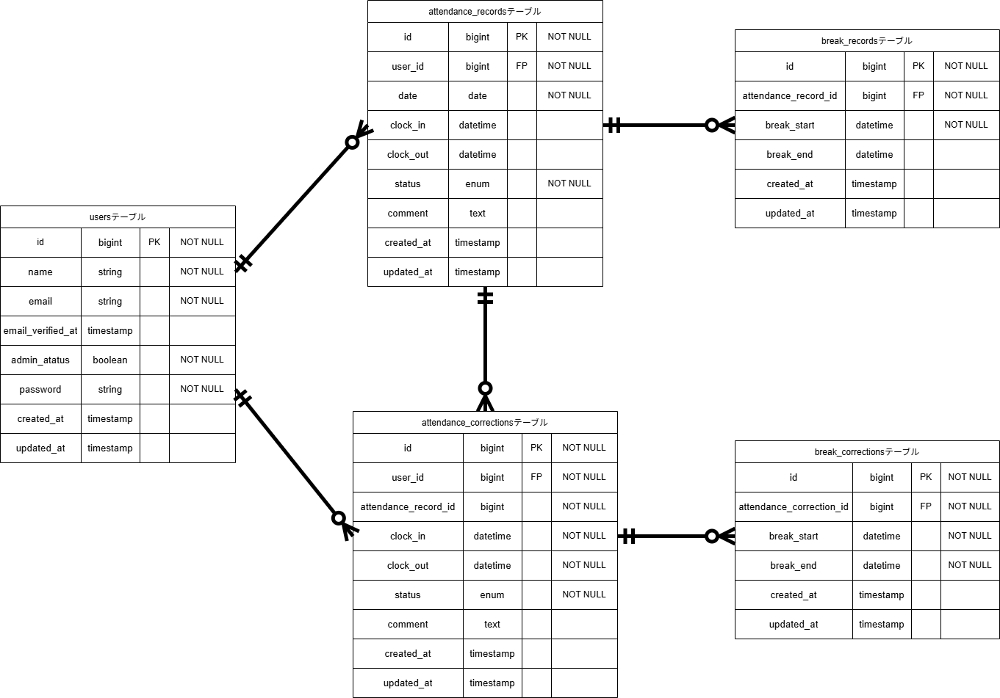

# Attendance-management
# 勤怠管理システム（atte）

従業員の出勤・退勤管理、休憩時間の記録、勤怠データの修正申請・承認を行うLaravelベースの勤怠管理システムです。一般ユーザーと管理者の2つのロールで異なる画面・機能を提供します。

---

## 📋 目次

- [システム概要](#システム概要)
- [主な機能](#主な機能)
- [システム要件](#システム要件)
- [セットアップ](#セットアップ)
- [ディレクトリ構成](#ディレクトリ構成)
- [APIエンドポイント](#apiエンドポイント)
- [テスト](#テスト)
- [開発上の注意](#開発上の注意)

---

## 🎯 システム概要

### 対応ユーザー
- **一般ユーザー**: 自分の勤怠情報の登録・確認・修正申請
- **管理者**: 全従業員の勤怠管理・修正申請の承認・レポート確認

### 主要技術スタック
| 用途 | 技術 |
|---|---|
| フレームワーク | Laravel |
| 認証 | Laravel Fortify / Laravel Sanctum |
| バリデーション | FormRequest |
| テスト | PHPUnit |
| 開発環境 | Docker (Windows + WSL2) |
| メール検証 | Mailhog / Mailtrap |

---

## ✨ 主な機能

### 一般ユーザー向け機能
- **打刻画面** (`/attendance`)
  - 出勤・退勤・休憩の開始/終了を記録
  - リアルタイムステータス表示（待機中 / 勤務中 / 休憩中 / 退勤済み）

- **勤怠一覧** (`/attendance/list`)
  - 自分の勤怠記録を一覧表示
  - 日付・月での絞り込み

- **勤怠詳細・修正** (`/attendance/detail/{id}`)
  - 勤怠情報の詳細表示
  - 出勤時間・退勤時間・休憩時間の修正申請

- **マイ勤怠レポート** (`/attendance/report`)
  - 過去6ヶ月の集計統計
  - 総労働時間、残業時間、遅刻・早退回数など

- **修正申請一覧** (`/stamp_correction_request/list`)
  - 自分が申請した修正リクエストの状態確認

### 管理者向け機能
- **勤怠一覧管理** (`/admin/attendance/list`)
  - 全従業員の勤怠情報を一覧表示
  - 日付・月での絞り込み

- **スタッフ管理** (`/admin/staff/list`)
  - 従業員一覧の表示
  - スタッフ別の勤怠履歴確認

- **修正申請承認** (`/stamp_correction_request/approve/{id}`)
  - 従業員からの修正申請を確認・承認/却下

- **勤怠情報修正** (`/admin/attendance/{id}`)
  - 管理者直接の勤怠データ修正

---

## 💻 システム要件

- **PHP**: 8.0以上
- **Laravel**: 8.0以上
- **Docker**: 最新版
- **WSL2** (Windows開発環境の場合)
- **Node.js**: 14.0以上（フロントエンド構築時）

---

## 🚀 セットアップ

### 1. リポジトリのクローン
```bash
git clone <repository-url>
cd atte
```

### 2. 環境変数の設定
```bash
cp .env.example .env
php artisan key:generate
```

### 3. Dockerコンテナの起動
```bash
docker-compose up -d
```

### 4. 依存パッケージのインストール
```bash
composer install
npm install
```

### 5. データベース初期化
```bash
php artisan migrate
php artisan db:seed
```

### 6. メール検証の設定
Mailhog または Mailtrap を使用。`.env` の設定例：
```
MAIL_DRIVER=smtp
MAIL_HOST=mailhog
MAIL_PORT=1025
```

### 7. アプリケーション起動
```bash
php artisan serve
```

アクセスURL: `http://localhost:8000`

#### テストユーザー
| メール | パスワード | 種別 |
|---|---|---|
| user1@example.com | password | 一般ユーザー |
| user2@example.com | password | 一般ユーザー |
| user3@example.com | password | 管理者 |

---

## 📁 ディレクトリ構成

atte/
  app/
    Http/
      Controllers/
        AuthController.php           # 一般認証
        AttendanceController.php     # 勤怠管理
        CorrectionController.php     # 修正申請
        ReportController.php         # レポート表示
        Admin/                       # 管理者機能
          AuthController.php
          AttendanceController.php
          StaffController.php
          CorrectionController.php
          Api/V1/
            AttendanceRecordController.php  # API
      Requests/                        # バリデーション
      Middleware/
        AdminMiddleware.php
      Resources/
        AttendanceRecordResource.php
  UserResource.php
   ...
  Policies/
      AttendanceRecordPolicy.php
 Models/
 User.php
 AttendanceRecord.php
 BreakRecord.php
 AttendanceCorrection.php
  BreakCorrection.php
 Exceptions/
     Handler.php
database/
 migrations/                          # テーブル定義
 seeders/                             # ダミーデータ
 factories/                           # ファクトリー
resources/
 views/                               # Bladeテンプレート
    auth/
    attendance/
    correction/
    admin/
     layouts/
routes/
 web.php                              # 一般・管理者ルート
 api.php                              # APIルート
tests/
 Feature/                             # 機能テスト
 Unit/                                # ユニットテスト
docker-compose.yml
```

---

## 🔌 APIエンドポイント

### 勤怠情報API（`/api/v1/attendance-records`）

| メソッド | URI | 説明 | 認証 |
|---|---|---|---|
| GET | `/api/v1/attendance-records` | 勤怠一覧取得 | 不要 |
| GET | `/api/v1/attendance-records/{attendanceRecord}` | 勤怠詳細取得 | 不要 |
| POST | `/api/v1/attendance-records` | 勤怠登録 | **Sanctum** |
| PUT | `/api/v1/attendance-records/{attendanceRecord}` | 勤怠更新 | **Sanctum** + Policy |
| DELETE | `/api/v1/attendance-records/{attendanceRecord}` | 勤怠削除 | **Sanctum** + Policy |

### クエリパラメータ（一覧取得時）
```
GET /api/v1/attendance-records?user_id=1&date=2024-01-15&month=2024-01&per_page=20&page=1
```

| パラメータ | 型 | 説明 |
|---|---|---|
| `user_id` | integer | ユーザーID（オプション） |
| `date` | date | 特定日付（形式: Y-m-d） |
| `month` | string | 月単位（形式: Y-m） |
| `per_page` | integer | ページあたりレコード数（1-100） |
| `page` | integer | ページ番号 |

### レスポンス例（GET一覧）
```json
{
  "data": [
    {
      "id": 1,
      "user_id": 1,
      "date": "2024-01-15",
      "clock_in": "09:00:00",
      "clock_out": "18:00:00",
      "status": "finished",
      "breaks": [
        {
          "break_start": "12:00:00",
          "break_end": "13:00:00"
        }
      ],
      "comment": "通常勤務"
    }
  ],
  "meta": {
    "current_page": 1,
    "per_page": 20,
    "total": 45
  }
}
```

### エラーレスポンス
| ステータス | レスポンス |
|---|---|
| 404 | `{ "error": "勤怠情報が見つかりませんでした。" }` |
| 422 | `{ "message": "...", "errors": { "field": ["エラーメッセージ"] } }` |
| 403 | `{ "error": "この操作を実行する権限がありません。" }` |

---

## 🧪 テスト

### テスト実行
```bash
# 全テスト実行
php artisan test

# 特定ファイルのテスト
php artisan test tests/Feature/AuthTest.php

# カバレッジレポート生成
php artisan test --coverage
```

### テストケース一覧（20項目）
| ID | 項目 | テスト数 |
|---|---|---|
| 1 | 認証機能（一般ユーザー） | 6 |
| 2 | ログイン認証機能（一般ユーザー） | 3 |
| 3 | ログイン認証機能（管理者） | 3 |
| 4 | 日時取得機能 | 1 |
| 5 | ステータス確認機能 | 4 |
| 6 | 出勤機能 | 3 |
| 7 | 休憩機能 | 5 |
| 8 | 退勤機能 | 2 |
| 9 | 勤怠一覧情報取得機能（一般） | 5 |
| 10 | 勤怠詳細情報取得機能（一般） | 4 |
| 11 | 勤怠詳細情報修正機能（一般） | 7 |
| 12 | 勤怠一覧情報取得機能（管理者） | 4 |
| 13 | 勤怠詳細情報取得・修正機能（管理者） | 5 |
| 14 | ユーザー情報取得機能（管理者） | 5 |
| 15 | 勤怠情報修正機能（管理者） | 4 |
| 16 | メール認証機能 | 3 |
| 17 | 公開API読み取り系 | 3 |
| 18 | 公開API書き込み系 | 4 |
| 19 | Sanctum認証 | 3 |
| 20 | マイ勤怠レポート機能 | 3 |

---

## 📊 データベース設計

### テーブル一覧
